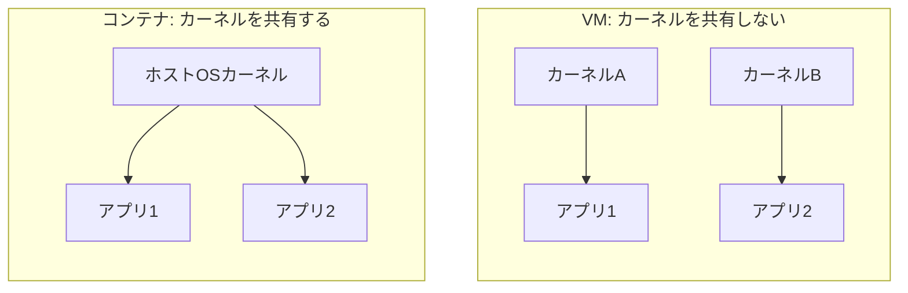

# 学習メモ・QA集

このファイルは、01章「コンテナとイメージとは」を学習する中で出た疑問と回答をQA形式でまとめたメモです。

---

## Q. VMとコンテナの違いは?

**A.**
一番の違いは「OSのカーネルを共有するかどうか」です。

- **VM**: 1台の物理マシンの上で、複数の「OSまるごと(カーネル含む)」をそれぞれ独立に動かす → 重い・遅い
- **コンテナ**: 複数のコンテナが「ホストOSのカーネル」を1つ共有する → 軽い・速い

### 図解: カーネルを共有しない(VM) / 共有する(コンテナ)

---

前へ: [README](README.md)
